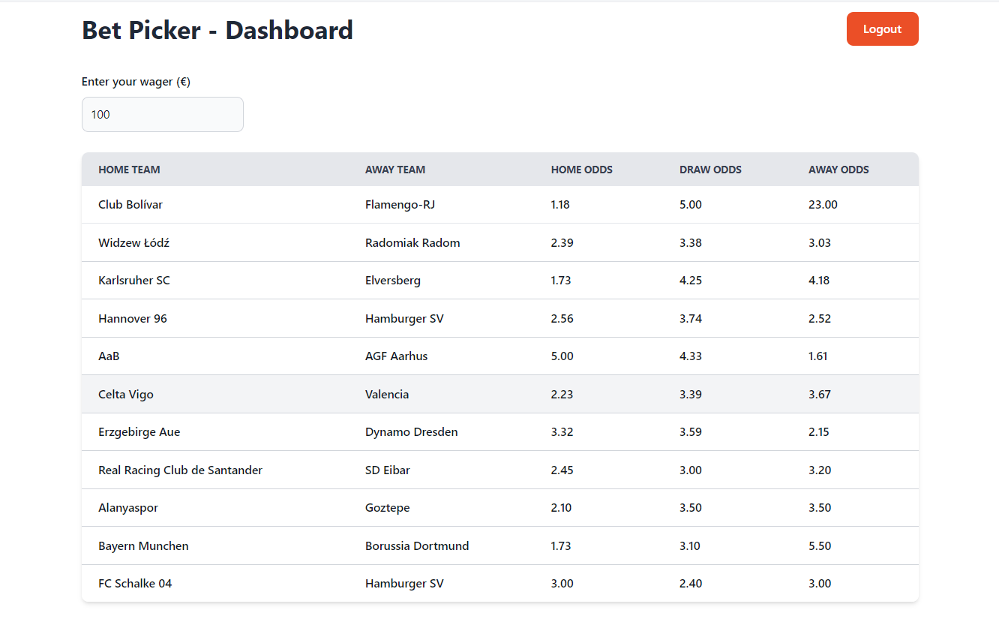
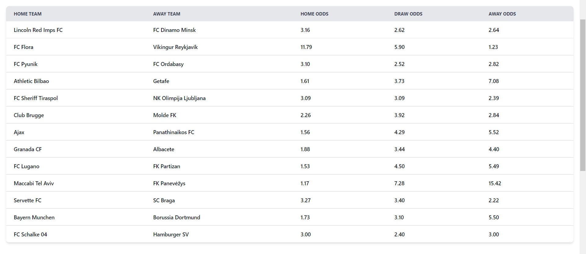
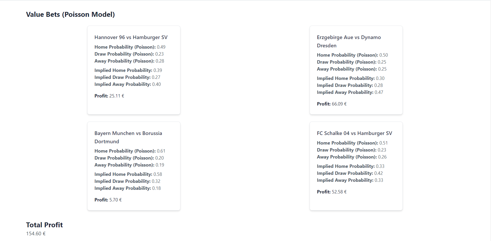

# Bet-Picker ⚽📊

A data-driven betting decision-support application that estimates match outcome probabilities using the Poisson model and highlights potential value bets.



---

## Overview

**Bet-Picker** is a web application designed to assist with sports betting analysis by comparing statistically derived probabilities against bookmaker odds.

The system calculates outcome probabilities, converts odds into implied probabilities, and identifies bets with positive expected value — helping transform betting decisions from intuition-based to data-informed.

> ⚠️ This project is intended for analytical and educational purposes only and does not guarantee profit.

---

## Preview

### Odds Overview


### Value Bet Detection


---

## Key Features

- Probability estimation using the **Poisson distribution**
- Automatic comparison between model probabilities and bookmaker odds
- Detection of potential **value bets**
- Profit calculation based on user-defined wager
- Clean and responsive dashboard UI
- Serverless backend with Firebase Functions
- Modular architecture allowing future model extensions

---

## Tech Stack

**Frontend**
- Svelte
- TypeScript
- Vite

**Backend**
- Firebase Functions
- Node.js

**Architecture**
- Monorepo structure with separated frontend and backend
- Root-level scripts for simplified development workflow

---

## Project Structure

```text
Bet-Picker/
│
├── client/        # Svelte frontend
├── functions/     # Firebase serverless backend
├── docs/          # README images
└── package.json   # Root scripts
```

---

## Quickstart

### Prerequisites

Make sure you have installed:

- Node.js (LTS recommended)
- npm
- Firebase CLI

Install Firebase CLI globally:

```bash
npm install -g firebase-tools
```

---

### Install Dependencies

Install dependencies for the root project and sub-packages:

```bash
npm install
npm install --prefix client
npm install --prefix functions
```

---

### Run the Application

Start the frontend:

```bash
npm run start:dev
```

Start Firebase Functions locally:

```bash
npm run start:functions
```

The frontend development server will typically be available at:

```
http://localhost:5173
```

---

## How It Works

1. The application retrieves match odds.
2. The Poisson model estimates the probability of each outcome.
3. Bookmaker odds are converted into implied probabilities.
4. The system compares model probabilities with implied probabilities.
5. Bets with positive expected value are highlighted along with projected profit.

---

## Engineering Highlights

- Root-level orchestration scripts for cleaner developer experience  
- Clear separation between frontend and backend services  
- Serverless architecture for scalability  
- Strong emphasis on statistical modeling rather than heuristic predictions  
- Designed with extensibility in mind (additional models can be integrated)

---

## Future Improvements

- Historical backtesting
- Advanced probability models (xG, ELO, ML-based predictions)
- Arbitrage detection
- Bankroll management tools
- Docker support
- CI/CD pipeline

---

## License

This project is licensed under the MIT License.

---

## Disclaimer

Betting involves financial risk.  
This software is provided for research and educational purposes only.
